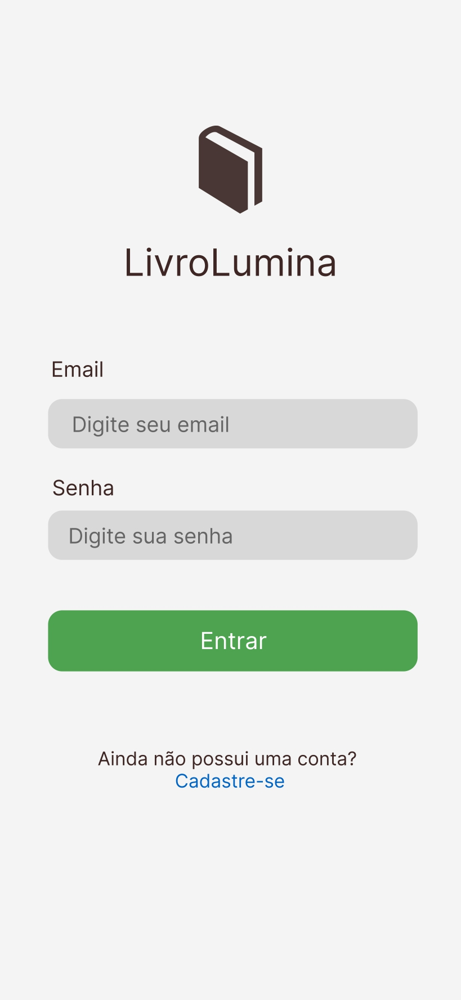
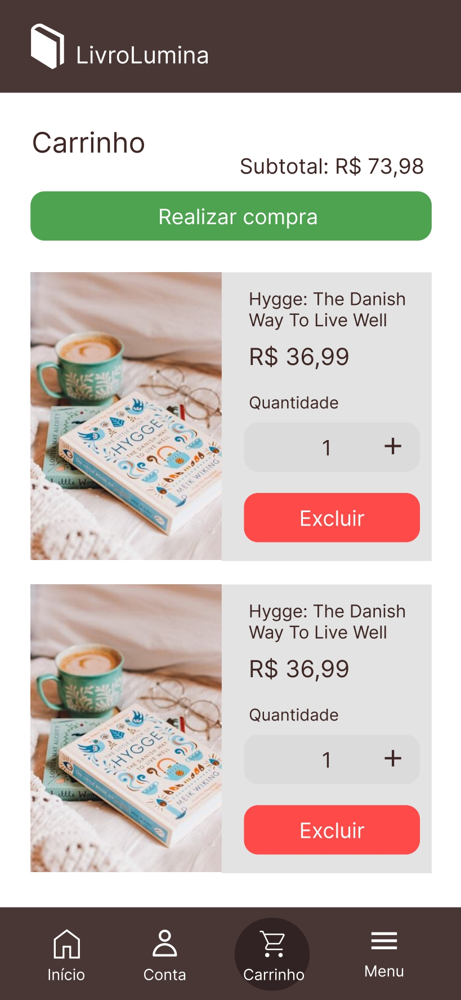
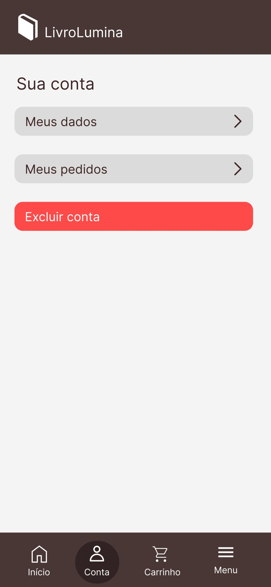
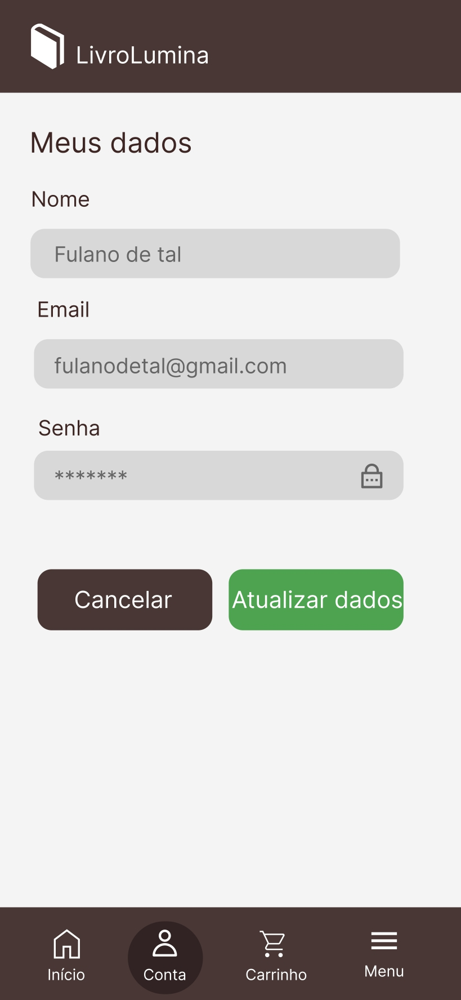
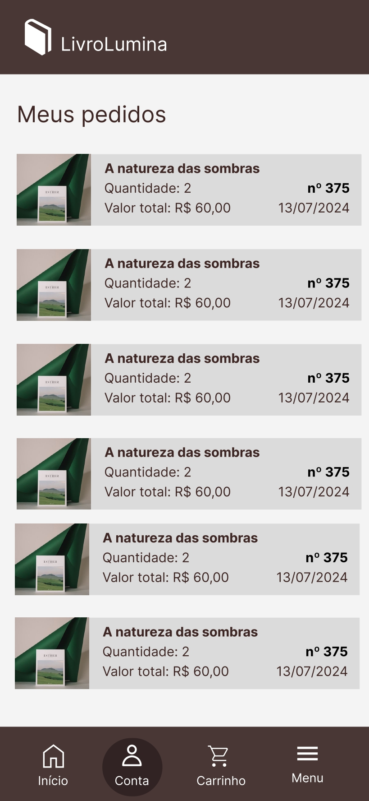
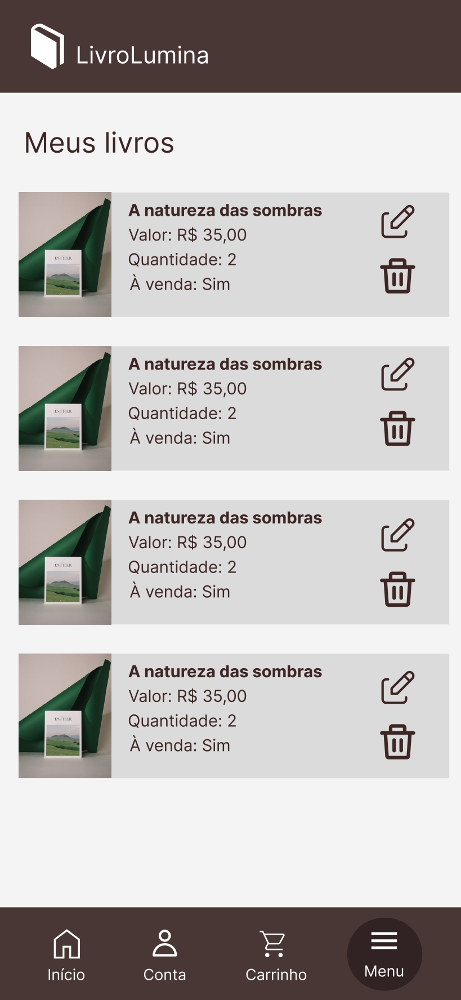
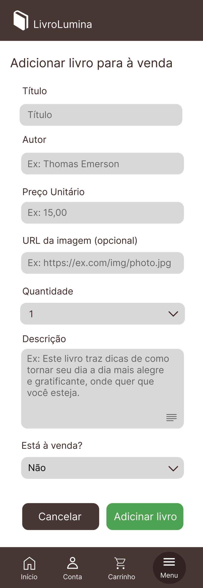
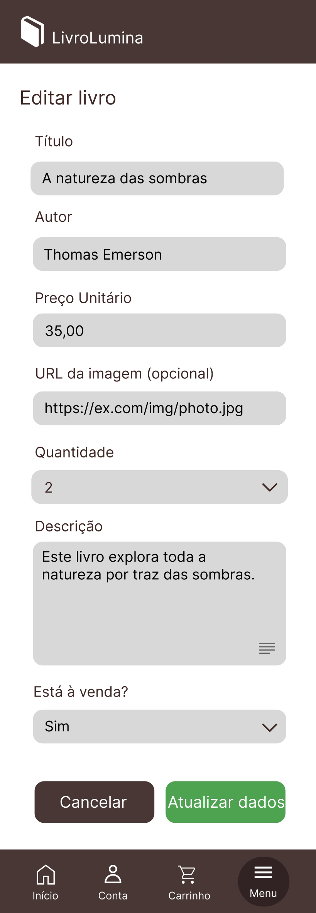
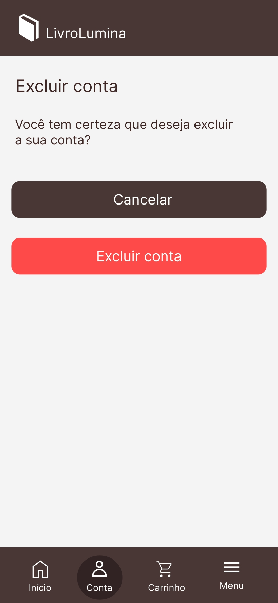
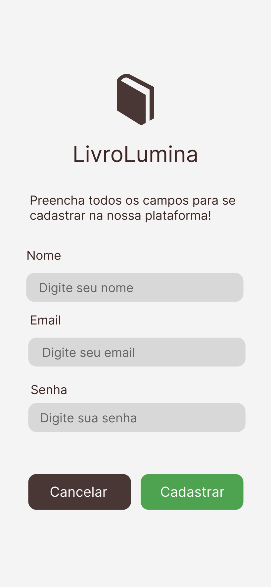

# 📚 LivroLumina — Aplicativo de E-commerce de Livros

Aplicação mobile desenvolvida em **Flutter** que implementa um **e-commerce de compra e venda de livros entre usuários**.  
O sistema permite que os usuários atuem **simultaneamente como compradores e vendedores**, navegando por um catálogo de livros, realizando compras e cadastrando seus próprios livros para venda.

---

# 📸 Screenshots

<p align="center">
  
  
  
  
  
</p>

<p align="center">
  
  
  
  
  
</p>

<p align="center">
  
</p>

---

# 🎯 Objetivo do Projeto

O objetivo do aplicativo é simular um **marketplace de livros**, onde os usuários podem:

- Criar uma conta
- Explorar livros disponíveis para compra
- Adicionar livros ao carrinho
- Realizar pedidos
- Gerenciar seus próprios livros para venda
- Administrar seus dados de conta

A plataforma garante autonomia ao usuário, permitindo inclusive a **exclusão da conta e de seus dados de transação**.

---

# 🚀 Funcionalidades

## 👤 Gerenciamento de Usuário
- Cadastro de novos usuários
- Login com autenticação por email e senha
- Visualização e edição de dados pessoais
- Exclusão da conta

## 📚 Catálogo de Livros
- Listagem de livros disponíveis para compra
- Visualização de detalhes de um livro
- Pesquisa de livros

## 🛒 Sistema de Compras
- Adicionar livros ao carrinho
- Alterar quantidade de itens
- Remover itens do carrinho
- Finalizar compra
- Visualizar histórico de pedidos

## 📦 Gestão de Livros para Venda
- Adicionar novos livros para venda
- Editar informações de livros cadastrados
- Remover livros da plataforma
- Controlar disponibilidade para venda

---

# 📱 Telas do Aplicativo

### 🔐 Tela de Login
<p align="center">
  
</p>

Permite que o usuário se autentique no aplicativo utilizando **email e senha**.

Campos disponíveis:

- Email
- Senha

---

### 📝 Tela de Cadastro
<p align="center">
  
</p>

Tela utilizada para **criação de uma nova conta** no sistema.

Campos de cadastro:

- Nome
- Email
- Senha

---

### 🏠 Tela Inicial
<p align="center">
  
</p>

Apresenta o **catálogo de livros disponíveis para venda**, com opções de pesquisa e detalhes do produto.

---

### 📖 Tela de Visualização do Produto
<p align="center">
  
</p>

Detalhes do livro selecionado, incluindo:

- Imagem do livro
- Título
- Autor
- Preço
- Seleção de quantidade
- Botão para adicionar ao carrinho

---

### 🛒 Tela de Carrinho
<p align="center">
  
</p>

Visualiza e gerencia todos os produtos adicionados ao carrinho.

---

### 👤 Tela de Conta
<p align="center">
  
</p>

Gerencia as opções de **conta do usuário**:

- Meus dados
- Meus pedidos
- Excluir conta

---

### ✏️ Tela de Meus Dados
<p align="center">
  
</p>

Permite atualizar dados cadastrados.

---

### 📦 Tela de Meus Pedidos
<p align="center">
  
</p>

Exibe o **histórico de compras**.

---

### 📚 Tela de Meus Livros
<p align="center">
  
</p>

Mostra os livros cadastrados pelo usuário como vendedor.

---

### ➕ Tela de Adicionar Livro
<p align="center">
  
</p>

Permite cadastrar novos livros para venda.

---

### ✏️ Tela de Editar Livro
<p align="center">
  
</p>

Edita informações de livros já cadastrados.

---

### ❌ Tela de Excluir Conta
<p align="center">
  
</p>

Remove a conta do usuário e seus dados.

---

# ⚙️ Tecnologias Utilizadas

- **Flutter**
- **Dart**
- **SQFlite (Banco de dados local)**

---

# ▶️ Como Executar o Projeto

### 1️⃣ Clonar o repositório
```bash
https://github.com/FelRG/ecommercelivros-app.git
```

### 2️⃣ Entrar na pasta do projeto
```bash
cd front_ecommercelivros
```

### 3️⃣ Instalar dependências
```bash
flutter pub get
```

### 4️⃣ Executar o aplicativo
```bash
flutter run
```

### 📦 Build do Aplicativo

Para gerar o APK:

```bash
flutter build apk
```
